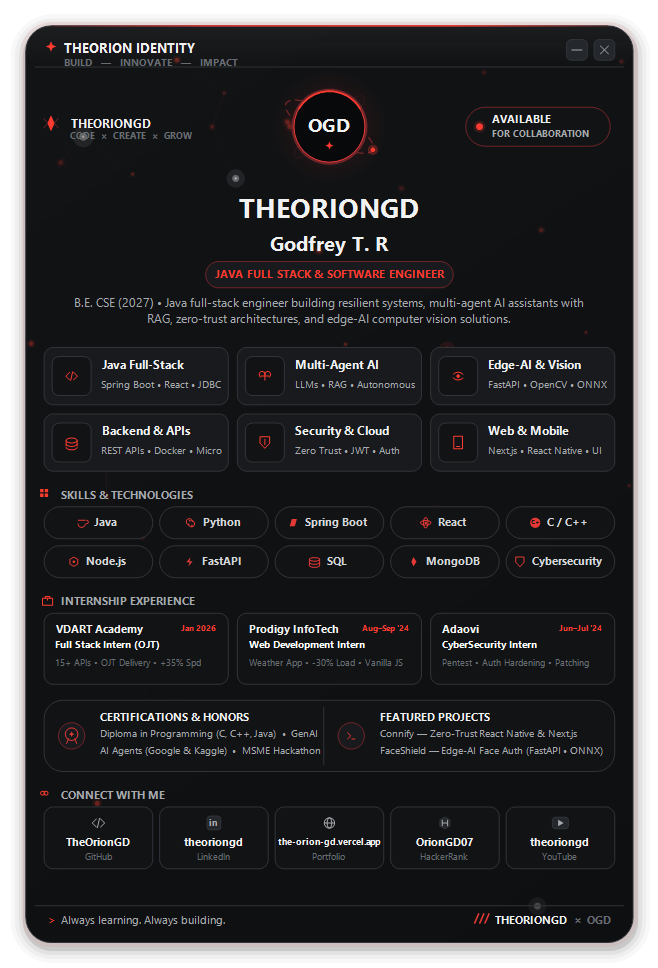

# TheOrionGD Identity Widget

A lightweight, hardware-composited 32bpp Windows desktop identity widget built with C# and .NET 8.0 Windows Forms. It displays developer focus areas, technology stacks, internship milestones, and quick connect links in an industrial cyberpunk HUD interface.

<p align="center">
  
</p>

---

## Highlights

- **32bpp Hardware-Composited Layered Window**: Uses the native Win32 `UpdateLayeredWindow` API (`WS_EX_LAYERED`) for true per-pixel alpha blending, soft outer shadows, and zero redraw flicker.
- **Cyberpunk Industrial Aesthetic**: Dark charcoal surface (`#0D0F11` / `#111315`) paired with high-contrast crimson energy accents (`#E53935` / `#FF3B30`).
- **Dynamic Particle Constellation Network**: Ambient floating cybernetic particles with proximity-based energy connection filaments drifting in real time behind the HUD cards with near-zero CPU overhead.
- **Smooth 30 FPS Motion**: Non-blocking timer driving a gentle breathing pulse, animated avatar energy rings, live particle drift, and dynamic glow effects.
- **Interactive Hitbox Routing**: Real-time cursor hover tracking across skill chips, focus area cards, internship timeline items, and connect actions.
- **Per-Monitor V2 DPI Scaling**: Automatically recalculates layout boundaries, typography metrics, and drawing pens to stay sharp on 1080p, 1440p, and 4K displays.
- **System Tray Companion**: Minimizes cleanly to the Windows notification tray with a custom-rendered brand icon and right-click context menu.
- **Headless Preview Renderer**: Built-in CLI flag (`--preview <output.png>`) to render pixel-perfect snapshots to disk without opening a GUI window.

---

## Interface Overview

```
┌─────────────────────────────────────────────────────────────┐
│  ✦ THEORION IDENTITY                       [ _ ]   [ X ]    │
│    BUILD — INNOVATE — IMPACT                                │
│                                                             │
│      OGD       THEORIONGD                                   │
│     (Avatar)   Godfrey T. R                                 │
│                [ JAVA FULL STACK & SOFTWARE ENGINEER ]      │
│                B.E. CSE (2027) • Java full-stack & AI roles │
├─────────────────────────────────────────────────────────────┤
│  CORE FOCUS AREAS                                           │
│  • Java Full-Stack         • Multi-Agent AI (RAG)           │
│  • Edge-AI & Vision        • Backend & APIs                 │
│  • Security & Cloud        • Web & Mobile                   │
├─────────────────────────────────────────────────────────────┤
│  SKILLS & TECHNOLOGIES                                      │
│  [Java] [Python] [Spring Boot] [React] [C/C++]              │
│  [Node.js] [FastAPI] [SQL] [MongoDB] [Cybersecurity]        │
├─────────────────────────────────────────────────────────────┤
│  INTERNSHIP EXPERIENCE                                      │
│  • VDart Academy    — Full Stack Intern (OJT)               │
│  • Prodigy InfoTech — Web Development Intern                │
│  • Adaovi           — Cybersecurity Intern                  │
├─────────────────────────────────────────────────────────────┤
│  CONNECT & PROFILES                                         │
│  [GitHub] [LinkedIn] [Portfolio] [HackerRank] [YouTube]     │
└─────────────────────────────────────────────────────────────┘
```

---

## Technical Stack & Architecture

- **Language & Runtime**: C# 12 / .NET 8.0 (`net8.0-windows`)
- **UI Subsystem**: Windows Forms with low-level Win32 GDI+ interop
- **Rendering Pipeline**:
  - Off-screen 32-bit ARGB DIB section (`CreateDIBSection`, `CreateCompatibleDC`)
  - Direct GDI+ `Graphics` drawing with `SmoothingMode.HighQuality` and `TextRenderingHint.ClearTypeGridFit`
  - Blitted directly to the Windows Desktop Window Manager (DWM) via `UpdateLayeredWindow`
- **Memory Footprint**: Extremely low resource usage (~25MB RAM), avoiding the multi-process overhead of web-based desktop wrappers.

---

## Project Structure

```
o:\Widget\
├── OrionGDWidget.csproj       # Project configuration (.NET 8.0-windows WinExe)
├── Program.cs                 # Entry point, DPI initialization, and CLI renderer
├── OrionGDForm.cs             # Main layered window, GDI+ rendering engine & events
├── Projects.md                # Project portfolio documentation
├── certificate_report.md      # Certifications, internships & academic records
├── .gitignore                 # Git ignore rules for .NET, IDEs, and system files
└── Readme                     # Project documentation
```

---

## Getting Started

### Prerequisites

- Windows 10 (Build 1809+) or Windows 11
- [.NET 8.0 SDK](https://dotnet.microsoft.com/download/dotnet/8.0) or higher

### Build from Source

Clone the repository and build using the .NET CLI:

```powershell
# Restore dependencies and build in Release mode
dotnet build -c Release

# Run the widget
dotnet run -c Release
```

### Headless CLI Snapshot

To render a screenshot of the widget without launching the window:

```powershell
dotnet run -- --preview preview.png
```

---

## Widget Controls

| Action | Control |
| :--- | :--- |
| **Move Widget** | Click and hold anywhere on the card surface, then drag |
| **Minimize to Tray** | Click the `_` button in the top right |
| **Close Application** | Click the `X` button in the top right |
| **Tray Context Menu** | Right-click the `OGD` icon in the system notification area |
| **Restore from Tray** | Double-click the tray icon or choose *Show / Hide Dashboard* |
| **Open External Links** | Click any social chip, project card, or focus card |

---

## Customization

The appearance and contents can be customized directly in `OrionGDForm.cs`:

- **Color Palette**: Defined near the top of `OrionGDForm.cs` (lines 98–125), including `C_BG_MAIN`, `C_RED_PRIMARY`, `C_RED_SIGNAL`, and border colors.
- **Focus Areas**: Configured inside `InitElements()` via `_focusCards.Add(...)`.
- **Skill Chips**: Listed inside `InitElements()` via `_skillPills.Add(...)`.
- **Internship Experiences**: Listed inside `InitElements()` via `_experienceCards.Add(...)`.
- **Social & Profile Links**: Configured in `_connectButtons.Add(...)` with custom URLs and icons.

---

## License

Personal project by **Godfrey T. R** ([@TheOrionGD](https://github.com/TheOrionGD)). Distributed under the [MIT License](LICENSE).
